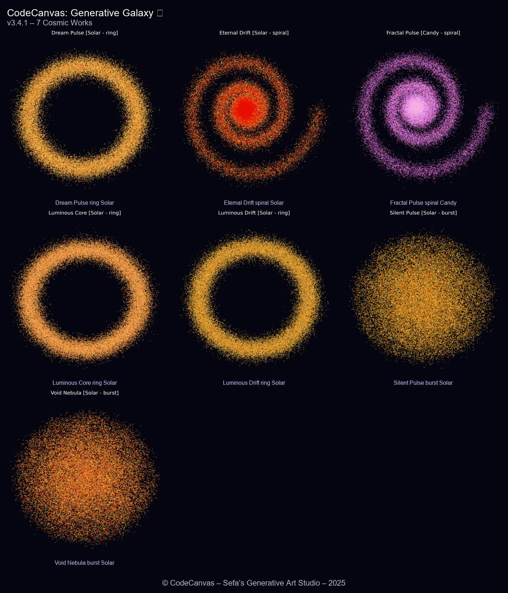

# CodeCanvas: Generative Galaxy

A Python generative-art project that creates procedural galaxy-inspired images, galleries, and collages from randomized visual parameters.

## Overview

Each run generates a unique abstract composition using combinations of galaxy type, color theme, naming, and rendering parameters. The project includes both command-line workflows and a small desktop studio for generating and reviewing outputs.

## Features

- procedural galaxy generation
- multiple visual forms, including spiral, ring, and burst patterns
- themed color modes such as Aurora, Solar, Void, and Candy
- randomized galaxy names
- transparent PNG export
- batch gallery generation
- automatic collage creation
- desktop GUI through `studio.py`

## Example Output

<p align="center">
  
</p>

## Tech Stack

- Python
- procedural image generation
- desktop GUI tooling
- PNG image export

## Project Structure

```text
CodeCanvas-Galaxy/
├── galaxy_generator.py
├── gallery_mode.py
├── gallery_collage.py
├── studio.py
├── outputs/
│   └── gallery/
├── requirements.txt
├── LICENSE
└── README.md
```

## Running Locally

Install dependencies:

```bash
pip install -r requirements.txt
```

Generate a single artwork:

```bash
python galaxy_generator.py
```

Generate a gallery batch:

```bash
python gallery_mode.py
```

Build a collage from generated images:

```bash
python gallery_collage.py
```

Launch the desktop studio:

```bash
python studio.py
```

## Purpose

This project is a creative coding experiment focused on procedural generation, image composition, and building small tools around generated visual output. It serves as a different kind of software project alongside my robotics, mobile, web, and machine-learning work.

## License

Released under the [MIT License](LICENSE).
